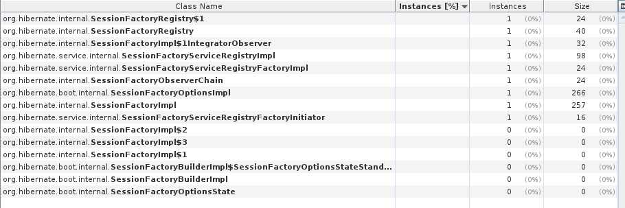

Test case for hibernate org.hibernate.internal.SessionFactoryImpl leak. When EJB is deployed/undeployed repeatedly on the 
Wildfly (at least 9.0.1 and 11.0), every undeployment leaks SessionFactoryImpl (+related classes)

If either

* CustomRevisionInfo class is removed
* EmbeddedId in the TestEntity is changed to normal id
* hibernate-jpamodelgen is removed from pom.xml (-> No metamodel classes are generated)

leak doesn't occur.

After deploying once

Second time

Third time
